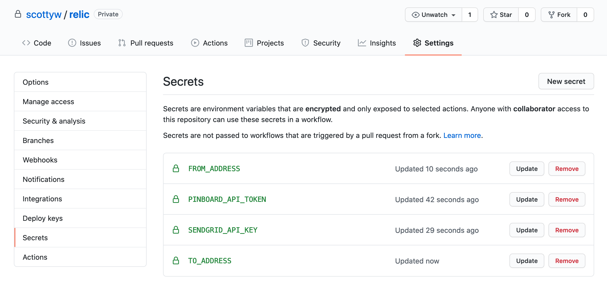
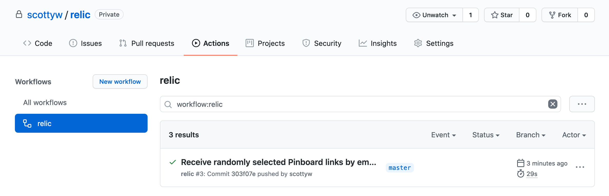
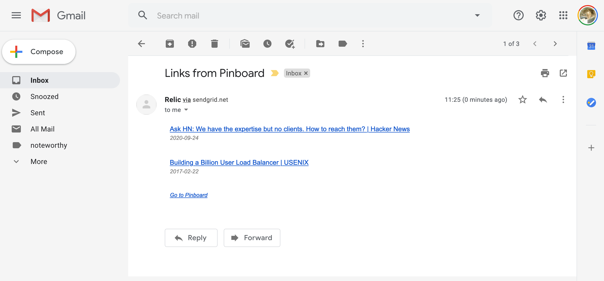

## Receive randomly selected Pinboard links by email via GitHub Actions

 

Receive randomly selected [Pinboard](https://pinboard.in) links by email send using [SendGrid](https://sendgrid.com).

### Setup

**Step 0: Fork this repo**

**Step 1: Configure your SendGrid account**

You'll need a [SendGrid](https://sendgrid.com) account - the free tier is fine.

You need to make sure you've configured your "[Single Sender Verification](https://app.sendgrid.com/settings/sender_auth)" in SendGrid. That confirms to them that you've access to the account you claim to be sending from. Their first time use workflow will walk you through it.

You also need to create an [API key](https://app.sendgrid.com/settings/api_keys).

**Step 2: Configure your GitHub secrets**

In your own repo, configure four secrets as follows:

| Secret name          | Value                                                                  |
| -------------------- | ---------------------------------------------------------------------- |
| `PINBOARD_API_TOKEN` | Your Pinboard API token (see https://pinboard.in/settings/password)    |
| `SENDGRID_API_KEY`   | The SendGrid API key created above                                     |
| `FROM_ADDRESS`       | The email address used in SendGrid during "Single Sender Verification" |
| `TO_ADDRESS`         | The address to send the email (can be the same as `FROM_ADDRESS`)      |

**Step 3: Check your GitHub Actions are running**

A new email is sent at 2am UTC and on every commit.

You can check the progress of a run in the "Actions" section of your repo.

### Examples

An email showing two randomly chosen links from Pinboard.

### Caveats

* The HTML template is terrible. I cobbled it together with no skill and if you have insight on how to tweak it in an email-friendly manner I am interested!
* The error handling is basic but should be enough to diagnose issues
* GitHub scheduled workflows are disabled automatically after 60 days of repository inactivity

### Thanks

This project makes use [Resty](https://github.com/go-resty/resty) and SendGrid Go API bindings.
